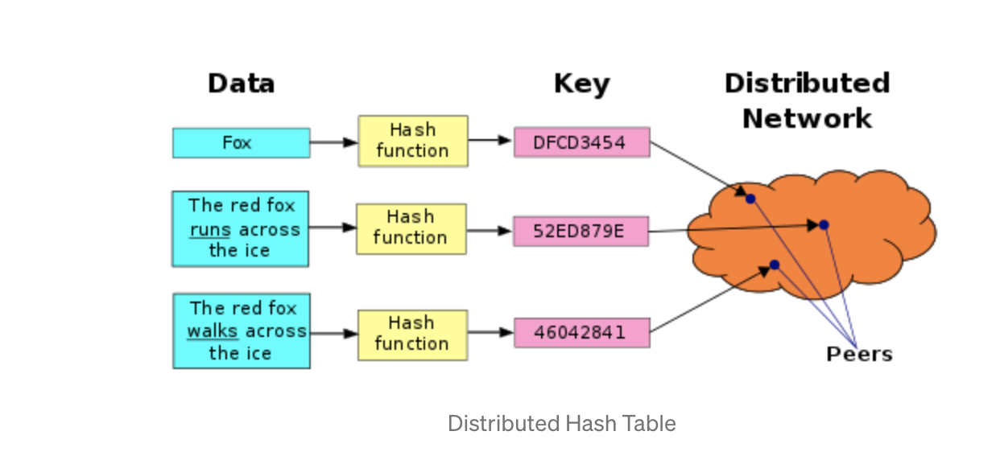

# Search

Product Search engine built in python using no 3rd party libraries.

## Run

The initial run will be slow as it builds the index. Subsequent runs will be quick as it attempts to load the index from file.

`python search.py "search term"`


## Approach

The approach to this work was to be as simple as possible given the 2hr time limit. For this I followed well known programming principles such as KISS and YAGNI to keep the code as streamlined as possible.

The result is by no means a production standard search engine and in fact comes with quite a few limitations in terms of performance and functionality due to the imposed time constraints and the other constraint of no 3rd party libraries. For instance I did not complete the 2 extra objectives: prefixes and approximate matching but at the bottom I will give a detailed breakdown of how I would solve both those problems.

### Loading data
Data was naively loaded into memory. If the data was line deliminated then we could stream the json in line by line, however in it's current form you would have to do some byte manipulation and perhaps read in by chunks.

### Indexing

The program features a basic inverted index which uses many linked lists to create a mapping from a token to a list of document ids mapped to their frequency. 

E.g. `'cosmetic': Counter({31748: 1, 31750: 1, 31747: 1})`

This was implemented using counters to provide an easy way of incrementing the document frequency.

Tokens were generated from a `TextAnalyzer` which is made up of a single `Tokenizer` and zero or more `TokenFilters`.

A `Tokenizer` takes in some text and splits it into a stream of tokens. The tokens are then passed over the `TokenFilters` which manipulate the token in some way e.g. converting the text to lowercase. 

A forward index was created purely to get the original document back and acted as the "product" database.

### Searching

Searching was implemented by applying the same tokenization steps as the index creation step on the search term. Then the resulting tokens are checked to see if there is a direct match on the index.

### Ranking

Ranking is also quite simple as it is done by adding up the term frequency of all the tokens. 

E.g. `Prada shirt` would score 2 points from the product `{'id': 1, 'name': 'Plaid Shirt', 'brand': 'Prada'}` because it contains `prada` and `shirt`.

If we changed it to `prada plaid shirt` then we can expect a score of 3.
Output: 
```
{'Score': 3.0, 'product': {'id': 20636, 'name': 'Plaid Shirt', 'brand': 'Prada'}}
{'Score': 2.0, 'product': {'id': 69461, 'name': 'Prada Contrast Arm Aviator Sunglasses', 'brand': 'Prada'}}
{'Score': 2.0, 'product': {'id': 69465, 'name': 'Prada Linea Rossa Uni Lens Sunglasses', 'brand': 'Prada Linea Rossa'}}
{'Score': 2.0, 'product': {'id': 40979, 'name': 'Prada Classic Visor Sunglasses', 'brand': 'Prada'}}
{'Score': 2.0, 'product': {'id': 69458, 'name': 'Prada Linea Rossa Aviator Sunglasses with Square Frame', 'brand': 'Prada Linea Rossa'}}
{'Score': 2.0, 'product': {'id': 48316, 'name': "Prada Women's Large Rimless Opaque Arm Sunglasses", 'brand': 'Prada'}}
{'Score': 2.0, 'product': {'id': 48045, 'name': 'Prada Unisex Rectangular Acetate Sunglasses', 'brand': 'Prada'}}
{'Score': 2.0, 'product': {'id': 20665, 'name': 'Stripe T Shirt', 'brand': 'Prada'}}
{'Score': 2.0, 'product': {'id': 64955, 'name': 'Bib Detail T Shirt', 'brand': 'Prada'}}
{'Score': 2.0, 'product': {'id': 12669, 'name': 'L/S Plaid Club Fit Sport Shirt', 'brand': 'Faconnable'}}
```

As you can see the search is very basic and not great, ideally we would like to see other shirts come up after the "Plaid Shirt" rather than
more prada non-shirt content. Improvements on this and the entire application will be stated below.

## Productionized approach

So the ultimate task is how do we take what we have and scale it up to the moon?

I'm going to assume for this step we aren't allowed to use an existing off the shelf product like AWS elastic search and instead we have to take our home grown solution.

The way I thought about this was breaking up the task into 3 steps: 
- data loading (and processing)
- indexing
- search (and ranking)

Here is the overall architecture I came up with which is inspired by many of the most popular distributed hash tables today such as: amazon dynamo, google big table, casandra, oracle nosql, redis, memcached and dgraph.


### Data loading

This toy project is capable of handling 70k files of relatively small json but how do we scale this number up to billions of products?

Attempting to read the data all at once simply won't work because it's too big to fit into  a single computer's memory.

Instead we need to stream the products (this can either be serially or in batches). The stream should be handled like a message bus with built in message replay ability so we can pick up from where we left off if the subscriber was to go down.

The stream doesn't need to be ordered as this will be handled by the consumers, so can be designed for maximum throughput.


### Data processing

The data processing layer could be abstracted out as it's own package so it can scale as much as required.

I envisioned the overall architecture of the data processor to remain the same i.e. a tokenizer splits the text into tokens and then operations are performed over the text filters with each filter piping it's output to the next. 

However I think we can do a lot better in terms of the actual logic on this step to create a better search engine. By leveraging the NLTK library (or something similar maybe [spaCy](https://github.com/explosion/spaCy)) we can perform all the usual natural language processing (nlp) steps e.g:

- basic cleaning operations (remove special charaters + punctuation, lowercase, remove extra white space, stemming, lemmatization, etc.)
- Convert documents to vectors (train model) (using [fastText](https://github.com/facebookresearch/fastText))

The approach we used earlier was called bag of words, but I've opted to swap it out for a vector space model as it makes it super easy to compute the relevance between 2 search terms in a scalable and efficient manner which we will talk about later on. 

Furthermore a library like [gensim](https://github.com/rare-technologies/gensim) allows us to build an embedded vector which takes into account words with similar meaning according to a particular corpus.

At the end of the pre-processing stage we sort our mapping of vectors by the search term alphabetically. Remember in a huge distributed system we need to be able to scale up massively which means having multiple indexes i.e. sharding; where the data is split across multiple indexes. Alphabetically sorted terms allows finding the correct node by using binary search therefore reducing the node search from O(n) to O(log n).

### Indexing

#### Index Structure

A typical index looks like this: 


Here we see that the term is mapped to each document id. The 1st number is the term frequency and the 2nd number in the brackets is it's position. 
The position is stored because we might want to allow phrase matching or search highlighting of the terms matched. Imagine a dropdown where you wish to have your search highlighted amongst all the results shown. 


This index shows an interesting way of solving how to search for prefixes in the index in a typical bag of words model. Here we can see that the index terms are prefixed compressed and the location identifiers are represented as the difference. 

For example, the posting (cat,328) is represented by the sequence of entries 3 "empty field" 17, where 3 indicates the length of the common prefix between the words for postings (cat,311) and (cat,328), the indicates that both postings refer to the same word, and 17 is the difference between the locations 328 and 311. 

Similarly, the posting (catch,103) is represented by the sequence of entries 3 ch 103, where 3 is the length of the common prefix of cat and catch, ch is the remaining suffix for catch, and 103 is the location.

Now it's clear if we search for "cat" we can also find "catch" at document 103 or "catcher" at document 147. 


However we will be using a vector spaced model for the following reasons:

- Simple model based on linear algebra
- Term weights not binary
- Allows computing a continuous degree of similarity between queries and documents
- Allows ranking documents according to their possible relevance
- Allows partial matching 

What is it?

Documents and queries are represented as vectors. Each dimension corresponds to a seperate term. If a term doesn't occur in the document then it's value is 0. 

Limitations:
- Long documents are poorly represented because they have poor similarity values (a small scalar product and a large dimensionality)
- Search keywords must precisely match document terms; word substrings might result in a "false positive match"
- Semantic sensitivity; documents with similar context but different term vocabulary won't be associated, resulting in a "false negative match".
- The order in which the terms appear in the document is lost in the vector space representation.
- Theoretically assumes terms are statistically independent.
- Weighting is intuitive but not very formal.

Most of these disadvantages can be solved by using Word2Vec or WordNet which is used to create and learn word associations from a corpus. The result is that even partial terms or synomonus words will be found in the index.

As well as the term-frequency (TF), prefixes and positions of the terms we may also want to store the inverse document frequency (idf) and the TF-IDF which can be used for powerful searches as discussed later. 

In our simple approach we only consider term frequency but one of the key drawbacks is the key word stuffing problem. This is where the document is stuffed with tons of words so it can match a large variety of terms.

To fix this problem we introduce TF-IDF.

TF-IDF stands for Term Frequency Inverse Document Frequency of records. It can be defined as the calculation of how relevant a word in a series or corpus is to a text. The meaning increases proportionally to the number of times in the text a word appears but is compensated by the word frequency in the corpus (data-set).

It's designed to reduce the weighted impact of words that appear frequently in documents i.e. "and" (this is a stopword so should be removed anyway). To apply this to our system we can do the following: `weights = tf-idf * w1 * w2 * wn` where w1..wn are other metrics of weight calculation e.g. is the product in stock?. We can then multiply the vectors by it's weight.

TF-IDF relies on knowing the number of documents, this works fine in a single index but doesn't work in a distributed approach. If we decide to compute TF-IDF from the local indexes then we actually introduce bias into the search and ranking would be skewed in favour of pages from query servers that return few results. One solution to this problem is introducing a global statistician. 

As you see on the diagram the statistician talks to the nodes to gather local statistical information and aggregates it. During the index creation phase the statistician will then send back the global stats to the nodes and they will store it to disk (SS Table).

The SS Table contains statistical data as well as important metadata i.e. timestamps of writes, clustering keys and original document mapping to allow easy access to the documents properties given a document id.


#### Partitioning

When we create multiple nodes containing our indexes we introduce some extra challenges: 
- How does the node know where to query for the term?
- If a new node joins the network how is this managed?
- If a node dies what happens to it's data?

The simplest possible way to accomplish this would be to cut the data into S partitions (one per server) and store copies of a given key K on N servers. If you have N servers, you hash your key with the hash function and take the resulting integer modulo N.




i.e. `server = server_list[ hash(key) % N ]`

This allows us anyone to identify the correct server without needing to introduce a centralised governing agent (aka peer-2-peer), but it comes with a few downsides: 
- If a node goes down (or new nodes introduced) then `N` would be changed and the server chosen would be different
- Uneven distribution of data (some nodes with extremely heavy loads whilst others have nothing).

To solve this we introduce `consistent hashing`. 


Consistent hashing evenly distributes K objects across N bins as K/N for each. Thus, when N changes not all objects need to be moved.

The basic idea is that each server is mapped to a point on a circle with a hash function. To lookup the server for a given key, you hash the key and find that point on the circle. Then you scan forward until you find the first hash value for any server.

In practice, each server appears multiple times on the circle. These extra points are called “virtual nodes”, or "vnodes". With a small number of vnodes, different servers could be assigned wildly different numbers of keys. Virtual nodes allows us to add/remove nodes from the circle easily and we can also control the distribution of data amongst the nodes. 

We can extend this idea of virtual nodes by introducing weights which allows us to control the number of objects in the node according to the resources of the servers.

- Adding new nodes requires some of the existing keys to be re-distributed to the new node. 
- When a node leaves, keys which were assigned to leaving node are now assigned to the successor


#### Lookups

The basic approach for lookups would be to pass the key round the circle and ask each node can they find the key's value. This would be a O(n) look up. 

To avoid linear search we can use the chord protocol. 


The chord protocol relies on using a finger table (a routing table) to find the correct node for a given key.


The example given above is for a search `lookup(39)` it makes the path of `8 -> 32 -> 38`. Overall the speed should increase to O(log n) at the expense of storing this mapping.

One downside of this approach is that the finger tables need to be kept in sync otherwise the lookup will fail. So to solve this there needs to be a stabilization job that frequently occurs.

#### Distributed writes and handling temporary failures

There's various methods of handling distributed writes:
- 2 Phase commits -> Locks the system in place whilst commiting the object (very slow but provides consistency)
- Paxos/Raft Consensus style algorithm to decide on what value should be written 
- Vector clocks (difficult to implement)
- Last write wins (high chance of data loss but simple)


For failure resiliance I decided to go with a write-ahead log style system which is used in dgraph and casandra. Every write that is created is added to a log detailing what to write and where. This allows us to recover from a system crash by replaying all the logs since the last write.

The commit log also provides some optimizations when writing data. Because writing each change can be very expensive we instead use a mem table (cache) and when the cache is full it is flushed to the disk. 


#### Failure Detection

Permanent failure of nodes can be noticed by other nodes using the gossip protocol. When a node goes down we can re-distribute it's data to a new node(s) and re-route any queries to the new node.

### Search and ranking

Earlier I mentioned TF-IDF algorithm to calculate the weights for the vectors but now we are going to talk about BM-25.

The BM25 algorithm is a well known popular probabilistic scoring algorithm. In fact elastic-search has replaced TF-IDF for it!!

Why is it used?

One of the downsides of TF-IDF was that big documents still had really large scores over smaller ones. BM25 makes a few refinements on the TF-IDF algorithm to address these problems:

- Term frequency saturation. BM25 provides diminishing returns for the number of terms matched against documents. This is fairly intuitive, if you are looking to search for a specific term which is very common in documents then there should become a point where the number of occurrences of this term become less useful to the search.
  
- Document length. BM25 considers document length in the matching process. Again, this is intuitive; if a shorter article contains the same number of terms that match as a longer article, then the shorter article is likely to be more relevant.

I wanted to add a few more things to the scoring algorithm to make it more specific to the domain of product searching. 

There are many attributes to products which make them appealing. Some of the ones I thought of quickly:
- brand
- delivery speed
- Newness
- top selling product
- is it in stock?
- seasonal demand
- on going marketing campaign
- global trendiness

Based on these factors we may want to skew the scoring of BM25 to create a more personalized search. This allows us to do powerful things like promote new products, boost certain fields or disable showing products that are out of stock. 


#### Mispellings

Mispellings are commonly handled in search by an algorithm called levenshtein distance which computes the distance between 2 words.

E.g. "kitten", "sitting" has a distance of 3.

```
1. kitten → sitten (substitution of “s” for “k”)
2. sitten → sittin (substitution of “i” for “e”)
3. sittin → sitting (insertion of “g” at the end).
```

The levenshtein ratio can be computed from the distance equation to give a % of how similar 2 strings are.

For vectors we need to find a different approach for finding similarity. A basic approach would be to use the euclidean distance but the disadvantage of this is apparent in this example:

If you take a document 'd' and multiply it by itself to make d'. They both contain the same content yet the euclidean distance is going to be large between them indicating they aren't a match. We can fix this by using cosine similarity which instead looks at the angle of the vector and is unaffected by it's norm. 

Searching naively between your vector and every single one in the database is going to be very slow. Instead there exists libraries which use an approximate search (using k-nn) essentially trading a tiny amount of accuracy for blazing fast speeds. Two standout libraries in this domain are: [NMSlib](https://github.com/nmslib/nmslib) and spotify [annoy](https://github.com/spotify/annoy).


## Conclusion

If you made it this far, thanks for reading.